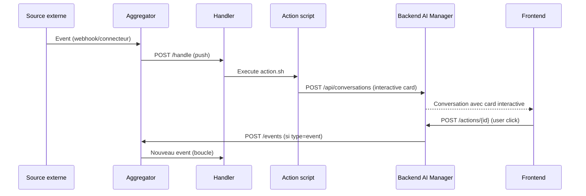

# Action Handler — Bonnes Pratiques

## Definition

Une action = un script declenche par le handler quand un event matche une rule. L'action recoit l'event en argument, execute sa logique, et sort. C'est le coeur du systeme event-driven.

---

## Architecture d'une action

### Structure fichiers

Chaque PID qui reagit a des events declare ses rules dans `meta.yaml` et ses actions dans `actions/` :

```
mon-pid/
├── meta.yaml
├── .venv/                    # Venv isole (cree automatiquement par le .sh)
└── actions/
    ├── handle-booking.sh     # Point d'entree — TOUJOURS un .sh
    ├── handle_booking.py     # Logique Python appelee par le .sh
    └── notify_team.py        # Autre script Python (optionnel, appele par le .sh)
```

### Declaration des rules (meta.yaml)

```yaml
name: mon-pid
description: "Gestion des reservations"

proxy:
  rules:
    - match: { source: "cal.com", type: "booking.created" }
      run: handle-booking
    - match: { source: "cal.com", type: "booking.cancelled" }
      run: handle-cancellation
  actions_dir: actions/
```

**Le handler resout automatiquement** : `run: handle-booking` → `{pid}/actions/handle-booking.sh`

**Matching :**
- Exact : `source: "cal.com"` + `type: "booking.created"`
- Wildcard : `type: "booking.*"` matche `booking.created`, `booking.cancelled`, etc.
- Catch-all : `source: "*"` + `type: "*"` — evalue en dernier (fallback)

---

## Regles

### 1. Le .sh est le point d'entree unique

Le handler execute toujours un `.sh`. C'est lui qui gere l'environnement et lance ce qu'il veut.

```bash
#!/bin/bash
SCRIPT_DIR="$(cd "$(dirname "${BASH_SOURCE[0]}")" && pwd)"
VENV="$SCRIPT_DIR/../.venv"

# Setup venv si besoin
if [ ! -d "$VENV" ]; then
  python3 -m venv "$VENV"
  "$VENV/bin/pip" install -q httpx
fi

# Lancer le script Python avec l'event en argument
exec "$VENV/bin/python3" "$SCRIPT_DIR/handle_booking.py" "$1"
```

**Pourquoi le .sh :**
- Isole les dependances (chaque PID a son venv)
- Setup automatique au premier lancement (lazy init)
- Fonctionne quel que soit le langage derriere (Python, Node, Go, etc.)
- Une seule commande = ca marche, robuste

**Le .sh peut orchestrer plusieurs scripts :**

```bash
#!/bin/bash
SCRIPT_DIR="$(cd "$(dirname "${BASH_SOURCE[0]}")" && pwd)"
VENV="$SCRIPT_DIR/../.venv"

if [ ! -d "$VENV" ]; then
  python3 -m venv "$VENV"
  "$VENV/bin/pip" install -q httpx anthropic
fi

# Etape 1 : enrichir
"$VENV/bin/python3" "$SCRIPT_DIR/enrich.py" "$1" || exit 1

# Etape 2 : notifier
"$VENV/bin/python3" "$SCRIPT_DIR/notify.py" "$1" || exit 1
```

### 2. Input/Output — pas de process bloquant

Une action s'execute et sort. C'est fondamental.

```python
# CORRECT — input/output
def main():
    event = json.loads(sys.argv[1])
    result = process(event)
    print(f"[handle-booking] done: {result}")

# INCORRECT — serveur qui reste bloquant
def main():
    app = Flask(__name__)
    app.run(port=5000)  # BLOQUE LE HANDLER

# INCORRECT — boucle infinie
def main():
    while True:  # BLOQUE LE HANDLER
        check_something()
        time.sleep(60)
```

**Si tu as besoin d'un process permanent, c'est un service** — deploye separement via `/build → /deploy`, pas dans le handler.

### 3. L'event arrive en argument JSON

Le handler passe l'event complet en `$1` (premier argument du .sh), qui le transmet au script Python.

```python
import json
import sys

def main():
    event = json.loads(sys.argv[1])

    event_id = event["id"]
    source = event["source"]
    event_type = event["type"]
    payload = event.get("payload") or {}
    timestamp = event["timestamp"]
    related_to = event.get("related_to")

    # Ta logique ici
    print(f"[action] processing {source}/{event_type}")
```

### 4. Acces aux outils lib/ via CLI (Profile System)

Les outils de `lib/` sont des CLIs globaux (dans le PATH via ecosystem.config.js). Chaque outil utilise le **profile system** pour resoudre ses credentials automatiquement.

**Appel direct** (les credentials sont resolues via `lib/.profiles/`) :

```python
import subprocess

# Envoyer un email (profil par defaut)
subprocess.run(["email", "send", "--to", "client@example.com", "--subject", "Confirmation"],
    capture_output=True, text=True)

# Envoyer un message Telegram
subprocess.run(["telegram", "send", "--text", "Nouvelle reservation"],
    capture_output=True, text=True)

# Envoyer un WhatsApp avec un profil specifique
subprocess.run(["whatsapp", "--profile", "pro", "send-text", "--chat-id", chat_id, "--text", "Hello"],
    capture_output=True, text=True)
```

**Depuis le shell** (dans le .sh de l action) :

```bash
# Profil par defaut
telegram send --text "Event recu: "

# Profil specifique
whatsapp --profile pro send-text --chat-id "" --text "Notification"

# Forcer un profil via variable d environnement (utile dans le PID .env)
export WHATSAPP_PROFILE=pro
whatsapp send-text --chat-id "" --text "Hello"
```

**Resolution des credentials** (ordre de priorite) :
1. `--profile <name>` (argument CLI explicite)
2. `<TOOL>_PROFILE` (variable d environnement, ex: `WHATSAPP_PROFILE=pro`)
3. `lib/.profiles/<tool>/_default` (profil par defaut configure)
4. Profil unique auto-detecte (si un seul profil existe)

**Gerer les profils** :
```bash
profile list                        # Voir tous les outils et profils
profile add whatsapp pro            # Creer un profil (interactif, lit meta.yaml)
profile set-default telegram alerts # Changer le profil par defaut
profile show whatsapp perso         # Voir un profil (secrets masques)
```

### 5. Completion LLM via lib/

Pour un appel LLM simple (question → reponse, classification, analyse), utiliser le CLI claude-cli :

```python
# Appel simple (completion, pas un agent)
result = subprocess.run(
    ["claude-cli", "complete",
     "--model", "haiku",
     "--prompt", f"Classifie cet event: {payload_str}"],
    capture_output=True, text=True
)
classification = json.loads(result.stdout)
```

Ou directement via le SDK Anthropic si installe dans le venv de l'action :

```python
import anthropic

client = anthropic.Anthropic()
response = client.messages.create(
    model="claude-haiku-4-5-20251001",
    max_tokens=512,
    messages=[{"role": "user", "content": prompt}],
)
text = response.content[0].text
```

### 6. Agent IA via agent-invoke

Pour une tache complexe qui necessite raisonnement, outils, multi-turn :

```python
# Invoquer un agent via agent-invoke CLI
result = subprocess.run(
    ["agent-invoke", "chat", "context-search",
     f"Analyse cet event et trouve le client concerne: {payload_str}",
     "--json"],
    capture_output=True, text=True
)
response = json.loads(result.stdout)
```

→ Voir [agent-ia.md](agent-ia.md) pour les details.

### 7. Chaining d'events via POST /events

Si une action doit declencher des actions en aval, elle POST un nouvel event a l'aggregator :

```python
import httpx

AGGREGATOR_URL = os.environ.get("AGGREGATOR_URL", "https://events.multimodal-house.fr")

# Chainer : l'action booking cree un event lead
httpx.post(f"{AGGREGATOR_URL}/events", json={
    "source": "action:handle-booking",
    "type": "lead.created",
    "related_to": event_id,  # Lien vers l'event parent
    "payload": {
        "name": payload["name"],
        "email": payload["email"],
        "origin": "cal.com"
    }
})
```

**`related_to`** cree une chaine tracable : event original → enrichment → action → etc.

**Convention source pour les events emis par des actions :**
- `action:{nom-action}` — event emis par une action handler
- `system` — event systeme (trigger, health check, etc.)
- `connector:{source}` — event d'erreur d'un connecteur

### 8. Une rule = une action complete

Pas de chaine de plusieurs rules pour traiter un seul event. Si l'action doit faire plusieurs choses, c'est le `.sh` qui orchestre.

```yaml
# CORRECT — une rule, un .sh qui fait tout
proxy:
  rules:
    - match: { source: "cal.com", type: "booking.created" }
      run: handle-booking  # Le .sh appelle enrich.py puis notify.py

# INCORRECT — plusieurs rules qui se chainient pour le meme event
proxy:
  rules:
    - match: { source: "cal.com", type: "booking.created" }
      run: enrich-booking
    - match: { source: "action:enrich-booking", type: "enriched" }
      run: notify-booking
    - match: { source: "action:notify-booking", type: "notified" }
      run: update-crm
```

Le chaining via events est reserve aux cas ou un event business DIFFERENT est produit (ex: une reservation cree un lead).

---

## A ne PAS faire

| Interdit | Pourquoi | Alternative |
|----------|----------|-------------|
| Lancer un serveur dans une action | Bloque le handler | Deployer comme service separe |
| Boucle infinie / `while True` | Bloque le handler | Utiliser le scheduler de l'aggregator |
| Acceder a la DB directement | L'action est isolee, pas de pool DB | Passer par les APIs (aggregator, backend AI Manager) |
| Creer des boucles d'events | Action A trigger B qui trigger A | Une rule = une action complete |
| Hardcoder des URLs / credentials | Fragile, pas portable | Variables d'environnement |
| Importer des modules Python de lib/ | Les venvs sont isoles | Appeler via CLI global (dans le PATH) |
| Ignorer les exit codes | L'erreur passe silencieusement | `|| exit 1` dans le .sh, try/except en Python |

---

## Interactive Cards (Notifications structurees)

### Concept

Une action handler peut creer une **conversation interactive** dans l'AI Manager au lieu d'un simple log. L'utilisateur voit une card structuree avec du texte, des formulaires et des boutons d'action. Quand il clique un bouton, le backend execute l'action definie (webhook, event, resolve, link).

### Flow complet



### Creer une conversation interactive depuis une action

```python
import httpx
import os

BACKEND_URL = os.environ.get("BACKEND_URL", "http://127.0.0.1:4810")
BACKEND_KEY = os.environ.get("BACKEND_INTERNAL_KEY", "proxy-internal-key")

def create_interactive_conversation(event):
    payload = event.get("payload", {})

    httpx.post(
        f"{BACKEND_URL}/api/conversations",
        headers={"X-Internal-Key": BACKEND_KEY},
        json={
            "pid": "system",
            "model": "claude-sonnet-4-20250514",
            "type": "human",
            "initiated_by": "proxy",
            "first_message": {
                "content": f"Nouvel event de {event['source']}",
                "interactive": {
                    "body": [
                        {"type": "text", "text": "**Nouveau message recu**", "weight": "bold"},
                        {"type": "fact-set", "facts": [
                            {"label": "Source", "value": event["source"]},
                            {"label": "Type", "value": event["type"]},
                        ]},
                        {"type": "text", "text": payload.get("content", "No content")},
                        {"type": "input", "id": "reply", "input_type": "textarea",
                         "label": "Reponse", "placeholder": "Tapez votre reponse..."},
                    ],
                    "actions": [
                        {
                            "id": "send-reply",
                            "label": "Envoyer",
                            "style": "primary",
                            "action": {
                                "type": "event",
                                "source": f"interactive:{event['source']}",
                                "event_type": "reply.sent",
                                "related_to": event["id"],
                                "payload": {"original_event": event["id"]}
                            },
                            "inputs": "all",
                            "resolves": True
                        },
                        {
                            "id": "dismiss",
                            "label": "Ignorer",
                            "style": "ghost",
                            "action": {"type": "resolve"}
                        }
                    ]
                }
            }
        }
    )
```

### Types d'action disponibles

| Type | Description | Champs requis |
|------|-------------|---------------|
| webhook | POST/PUT/DELETE generique | url, method, payload |
| event | Cree un event dans l'aggregator | source, event_type, related_to, payload |
| link | Ouvre une URL dans le navigateur | url |
| resolve | Marque la conversation comme resolue | (aucun) |

Chaque bouton peut aussi avoir `"resolves": true` pour resoudre la conversation en plus de son action principale.

### Elements du body

| Type | Description | Champs |
|------|-------------|--------|
| text | Texte markdown | text, weight (bold/normal) |
| media | Image, video, fichier | url, mime, alt |
| fact-set | Grille cle/valeur | facts (liste de label/value) |
| input | Champ de formulaire | id, input_type, label, placeholder, options, value |

Types d'input : text, textarea, select, toggle, date, number.

### Inputs des boutons

Le champ `inputs` d'un bouton controle quels champs de formulaire sont envoyes :

- `"all"` — tous les champs input du body
- `["field1", "field2"]` — seulement ces champs
- `"none"` (defaut) — aucun champ

### Handler /events proxy

Le handler expose `POST /events` et `GET /events` qui proxifient vers l'aggregator avec auth. Les scripts d'action utilisent `PROXY_URL` (= handler localhost) pour chainer des events :

```python
# Dans une action — fonctionne tel quel grace au proxy handler
httpx.post(f"{PROXY_URL}/events", json={
    "source": "action:mon-action",
    "type": "result.created",
    "related_to": event_id,
    "payload": {"result": "..."}
})
```

## Checklist avant mise en production

- [ ] Le `.sh` est executable (`chmod +x`)
- [ ] Le `.sh` gere le setup venv + deps
- [ ] L'action est input/output (pas de process bloquant)
- [ ] L'event est parse correctement (`json.loads(sys.argv[1])`)
- [ ] Les credentials sont en variables d'environnement
- [ ] Les erreurs sont catchees et loguees
- [ ] Teste manuellement avec un `curl POST /events`
- [ ] La rule est declaree dans `meta.yaml`

***
