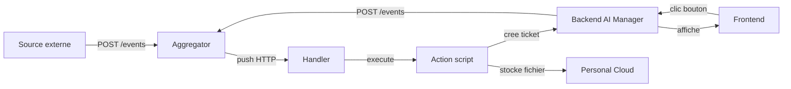
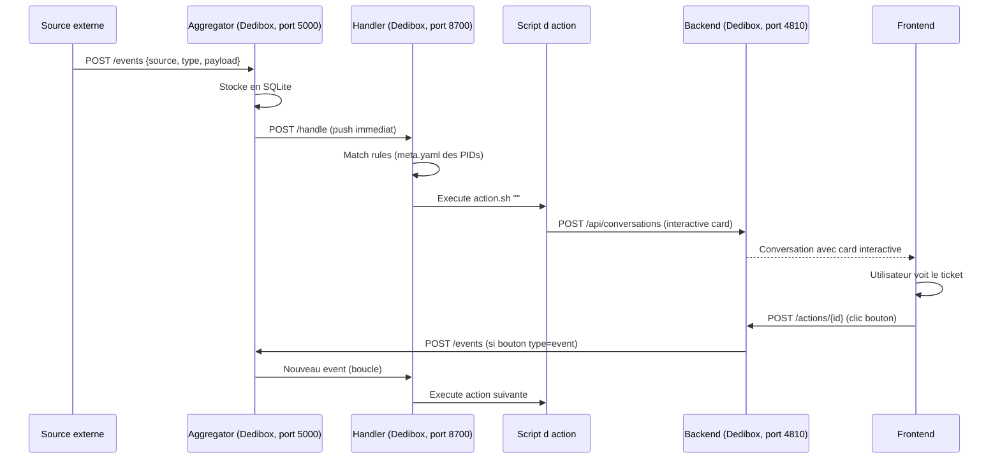

# Infrastructure Live — Services en Production

## Vue d'ensemble

6 services tournent en permanence. Ensemble, ils forment le systeme event-driven qui permet de capturer des evenements externes, les traiter, stocker des fichiers, et interagir avec l'utilisateur.



---

## Les 6 services

### 1. Aggregator — reception et stockage des events (multi-tenant)

| | |
|---|---|
| **Role** | Recoit les events depuis n importe quelle source, les stocke en SQLite, les transmet aux handlers enregistres par compte |
| **Ou** | Dedibox (PM2, process `aggregator`) |
| **URL publique** | Expose via Caddy (Let's Encrypt) — necessite un sous-domaine avec A record vers le VPS |
| **Port** | 5000 |
| **Auth** | Multi-tenant : header `X-Api-Key` (cle par compte), admin : header `Authorization: Bearer ADMIN_TOKEN` |
| **DB** | SQLite locale (`aggregator/data/aggregator.db`, WAL mode) |
| **CI/CD** | Git push → SSH → git pull → pm2 restart aggregator |

**Architecture multi-tenant :**
- Chaque workspace cree un **compte** via l'admin API
- Chaque compte a ses propres **cles API** (prefixe `agg_`, hashees SHA256)
- Les events sont **isoles par compte** — un compte ne voit jamais les events d'un autre
- Chaque compte enregistre ses propres **handlers** (URLs ou le push est envoye)

**Endpoints tenant (auth par X-Api-Key) :**

| Methode | Endpoint | Description |
|---------|----------|-------------|
| `POST /events` | Creer un event | Body JSON : `{source, type, payload}` |
| `GET /events` | Lister les events du compte | Query params : `source`, `type`, `limit`, `offset` |
| `GET /events/search` | Recherche full-text dans les payloads | Query param : `q` |
| `GET /events/filters` | Sources et types disponibles | — |
| `POST /handlers` | Enregistrer un handler | Body JSON : `{url, api_key, name}` |
| `GET /handlers` | Lister les handlers du compte | — |
| `PUT /handlers/{id}` | Modifier un handler | — |
| `DELETE /handlers/{id}` | Supprimer un handler (soft delete) | — |
| `GET /health` | Health check (public) | — |

**Endpoints admin (auth par Authorization: Bearer ADMIN_TOKEN) :**

| Methode | Endpoint | Description |
|---------|----------|-------------|
| `POST /admin/accounts` | Creer un compte | Body : `{name, email}` |
| `GET /admin/accounts` | Lister les comptes | — |
| `GET /admin/accounts/{id}` | Detail d'un compte | — |
| `DELETE /admin/accounts/{id}` | Desactiver un compte (soft delete) | — |
| `POST /admin/accounts/{id}/keys` | Creer une cle API | Body : `{name}` — la cle complete est retournee **une seule fois** |
| `GET /admin/accounts/{id}/keys` | Lister les cles d'un compte | Seul le prefixe est visible |
| `DELETE /admin/keys/{id}` | Revoquer une cle | — |

**Envoyer un event :**

```bash
curl -X POST https://events.multimodal-house.fr/events   -H "X-Api-Key: $AGGREGATOR_API_KEY"   -H "Content-Type: application/json"   -d '{"source": "test", "type": "ping", "payload": {"message": "hello"}}'
```

**Comportement :** des qu'un event est recu, l'aggregator le stocke ET le push immediatement a tous les handlers actifs du compte. Si un handler est down, retry automatique toutes les 30 secondes (batch de 50 events max).

**Auto-provisioning :** lors du `setup.sh` de l'AI Manager, un compte + cle API + handler local sont crees automatiquement. Le handler recoit l'URL `http://127.0.0.1:8700/handle` et la cle est injectee dans le `.env` du handler.

---

### 2. Handler — matching des rules et execution des actions

| | |
|---|---|
| **Role** | Recoit les events depuis l'aggregator, matche les rules des PIDs, execute les scripts d'action |
| **Ou** | Dedibox (PM2, process `ai-manager-handler`) |
| **URL interne** | `http://127.0.0.1:8700` |
| **Port** | 8700 |
| **Auth** | Header `X-Handler-Key` |
| **Exposition** | **Local only** — jamais expose sur internet ou Tailscale |
| **CI/CD** | Git push → SSH → git pull → pm2 restart ai-manager-handler |

**Endpoints :**

| Methode | Endpoint | Description |
|---------|----------|-------------|
| `POST /handle` | Recevoir un event (appele par l'aggregator) | Body JSON : event complet |
| `GET /rules` | Lister toutes les rules chargees | — |
| `GET /processes` | Lister les actions en cours d'execution | — |
| `DELETE /processes/{event_id}` | Tuer une action en cours | — |
| `POST /events` | Proxy vers l'aggregator (pour chaining depuis une action) | Meme format que l'aggregator |
| `GET /health` | Health check | — |

**Comment le handler trouve les rules :** il scanne les `meta.yaml` de tous les PIDs dans `/data/workspace/pids/`. Chaque PID declare ses rules dans la section `proxy.rules`.

**Variables d'environnement injectees dans les actions :**

| Variable | Valeur | Usage |
|----------|--------|-------|
| `PROXY_URL` | `http://127.0.0.1:8700` | Chainer des events depuis une action |
| `BACKEND_URL` | `http://127.0.0.1:4810` | Creer des tickets/conversations |
| `BACKEND_INTERNAL_KEY` | `proxy-internal-key` | Auth pour le backend depuis une action |
| `AGGREGATOR_URL` | `https://events.multimodal-house.fr` | POST direct a l'aggregator (meme URL que les sources externes) |
| `AGGREGATOR_API_KEY` | `agg_...` | Cle API pour l'aggregator local |

---

### 3. Backend AI Manager — conversations et tickets

| | |
|---|---|
| **Role** | Gere les conversations (humain <-> IA, systeme -> humain), stocke les messages, orchestre les appels LLM |
| **Ou** | Dedibox (PM2, process `ai-manager-backend`) |
| **URL** | `https://dedibox-hugo.taila12373.ts.net:4810` (Tailscale) |
| **Port** | 4810 |
| **Auth humain** | JWT (login via `/api/auth/login`) |
| **Auth systeme** | Header `X-Internal-Key` (valeur : `proxy-internal-key`) |
| **DB** | SQLite a `/data/ai-manager/backend/data/ai-manager.db` |

**Endpoints cles :**

| Methode | Endpoint | Description |
|---------|----------|-------------|
| `POST /api/conversations` | Creer une conversation (ou un ticket interactif) | Auth interne ou JWT |
| `GET /api/conversations` | Lister les conversations | JWT |
| `POST /api/conversations/{id}/messages` | Envoyer un message | JWT ou interne |
| `GET /api/conversations/{id}/events` | Stream SSE temps reel | JWT |
| `POST /api/search` | Recherche full-text | JWT |

**Mode "proxy" (tickets systeme) :** quand une action handler cree une conversation avec `initiated_by: "proxy"`, elle apparait dans le dashboard comme un ticket a traiter. L'utilisateur voit la card interactive, remplit les champs, clique un bouton → le backend execute l'action du bouton (webhook, event, resolve, link).

---

### 4. Frontend — dashboard web

| | |
|---|---|
| **Role** | Interface web pour voir les conversations, repondre aux tickets, monitorer les events |
| **Ou** | Dedibox (PM2, process `ai-manager-frontend`) |
| **URL** | `https://dedibox-hugo.taila12373.ts.net` (Tailscale) |
| **Port** | 4811 |
| **Stack** | Next.js 16 + shadcn/ui + Tailwind |

---

### 5. Personal Cloud — stockage de fichiers

| | |
|---|---|
| **Role** | API de stockage de fichiers (type S3) avec presigned URLs, multi-tenant par service |
| **Ou** | Dedibox (PM2, process `personal-cloud`) |
| **URL** | `https://dedibox-hugo.taila12373.ts.net:8200` (Tailscale) |
| **Port** | 8200 |
| **Auth** | Header `Authorization: Bearer sk_live_...` (cle par service) |
| **DB** | SQLite locale |

**Endpoints principaux :**

| Methode | Endpoint | Description |
|---------|----------|-------------|
| `PUT /v1/objects/{key}` | Upload un fichier (multipart) |
| `GET /v1/objects/{key}` | Download un fichier |
| `DELETE /v1/objects/{key}` | Supprime un fichier |
| `GET /v1/objects?prefix=...` | Liste les objets (pagination par cursor) |
| `POST /v1/presign` | Genere une URL presignee (upload ou download) |
| `GET /health` | Health check |

---

### 6. Registry Watcher — synchronisation des PIDs

| | |
|---|---|
| **Role** | Surveille les changements dans `/data/workspace/pids/` et reconstruit les registries automatiquement |
| **Ou** | Dedibox (PM2, process `registry-watcher`) |
| **Port** | Aucun (process background) |

---

## Flux complet (de bout en bout)



---

## Outils CLI disponibles

### interactive-card — creer des tickets depuis un script

CLI pour creer des conversations interactives (notifications, formulaires, tickets) sans ecrire le JSON a la main.

```bash
# Notification simple
interactive-card notify "Titre" "Contenu **markdown**"

# Formulaire avec validation
interactive-card prompt "Approuver ?"     --text "Description du besoin"     --fact "Client=John" --fact "Montant=500 EUR"     --input "reply:textarea:Votre reponse"     --approve "Valider" --reject "Ignorer"     --event-source "interactive:mon-pid"     --event-type "demande.approuvee"

# JSON complet (controle total)
interactive-card create '{"body":[...],"actions":[...]}'
interactive-card create --file card.json --title "A verifier"

# Tester la connexion au backend
interactive-card test
```

**Env vars** : `BACKEND_URL` et `BACKEND_INTERNAL_KEY` (deja injectees par le handler dans les actions).

**Depuis Python (dans une action) :**

```python
import subprocess
result = subprocess.run(
    ["interactive-card", "prompt", "Nouveau lead",
     "--text", f"Email: {payload['email']}",
     "--fact", f"Source={event['source']}",
     "--input", "reply:textarea:Reponse",
     "--approve", "Traiter", "--reject", "Ignorer",
     "--event-source", "interactive:lead",
     "--event-type", "lead.treated"],
    capture_output=True, text=True
)
```

**Utilisation programmatique (Python) :**

```python
from interactive_card.builder import CardBuilder
from interactive_card.client import create_conversation

card = (CardBuilder()
    .text("**Alerte**", bold=True)
    .fact_set({"Client": "John", "Montant": "500 EUR"})
    .input("action", "select", label="Action",
           options={"approve": "Approuver", "reject": "Refuser"})
    .button("ok", "Valider", "primary",
            action_type="event", source="interactive:billing",
            event_type="payment.action", inputs="all", resolves=True)
    .button("skip", "Plus tard", "ghost", action_type="resolve")
    .build())

result = create_conversation(card, title="Paiement echoue")
```

### agent-invoke — invoquer des agents IA

```bash
agent-invoke ask <agent> "prompt"       # one-shot
agent-invoke chat <agent> "prompt"      # session persistante
agent-invoke resume <session-id> "msg"  # reprendre une session
agent-invoke agents                     # lister les agents
agent-invoke sessions                   # lister les sessions
```

### Lib tools (CLI partages)

Tous les outils de `lib/` sont accessibles via CLI depuis les actions du handler. Les venvs sont dans le PATH. Les credentials sont resolues automatiquement via le **systeme de profils** (`lib/.profiles/`).

| CLI | Description | Exemple |
|-----|-------------|---------|
| `telegram` | Notifications Telegram | `telegram send --message "Alerte"` |
| `email` | Email via Gmail API / SMTP | `email send --to x@y.com --subject "Test"` |
| `whatsapp` | Messages WhatsApp via Unipile | `whatsapp send-text --chat-id "..." --text "Hello"` |
| `youtube` | Download, transcript, search | `youtube transcript --url "..."` |
| `image-generator` | Generation d'images | `image-generator generate --prompt "..."` |
| `transcriber` | Transcription audio/video | `transcriber transcribe --file audio.mp3` |
| `tts` | Text-to-speech local | `tts speak --text "Bonjour"` |
| `claude-cli` | Appel LLM (Haiku/Sonnet/Opus) | `claude-cli complete --model haiku --prompt "..."` |
| `erp` | CRM interne (leads, contacts) | `erp leads list` |
| `fathom` | Transcripts d'appels Fathom | `fathom list` |
| `profile` | Gestion des profils/credentials | `profile list`, `profile add telegram bot-2` |

**Multi-instance** : chaque CLI supporte `--profile <name>` pour selectionner un profil specifique. Sans `--profile`, le profil par defaut est utilise automatiquement. Voir la section "Systeme de profils" dans le CLAUDE.md partage.

---

## Process manager (pm2)

Tous les services sont geres par pm2 via un ecosystem centralise : `/data/ai-manager/ecosystem.config.js`

### Process actifs

| Nom pm2 | Categorie | Port | Health | Description |
|---------|-----------|------|--------|-------------|
| `ai-manager-backend` | core | 4810 | `/health` | API conversations + LLM |
| `ai-manager-frontend` | core | 4811 | — | Dashboard Next.js |
| `ai-manager-handler` | core | 8700 | `/health` | Event matching + actions |
| `personal-cloud` | core | 8200 | `/health` | Stockage fichiers |
| `aggregator` | core | 5000 | `/health` | Reception events (multi-tenant) |
| `registry-watcher` | core | — | — | Sync registries |
| `*` (connectors) | connector | — | — | Auto-decouverts depuis `pids/*/connector/start.sh` |

### Commandes pm2

```bash
pm2 list                        # Etat de tous les process
pm2 logs <nom>                  # Logs en temps reel
pm2 restart <nom>               # Redemarrer un process
pm2 stop <nom> / pm2 start <nom>
pm2 save                        # Persister la config (apres tout changement)
```

### Ajouter un nouveau service interne

Voir [service-interne.md](service-interne.md) pour le guide complet.

---

## Deploiement

### Tous les services (Dedibox, PM2)

- **Config PM2** : `/data/ai-manager/ecosystem.config.js`
- **Trigger** : git push sur `main` → SSH → `git pull` + rebuild + `pm2 restart all`
- **Workspace** : `/data/workspace` (synced via `./sync.sh push/pull`)

### Exposition reseau

| Service | Methode | Acces |
|---------|---------|-------|
| Frontend (:443) | Tailscale serve | Tailnet uniquement (prive) |
| Backend (:4810) | Tailscale serve | Tailnet uniquement (prive) |
| Personal Cloud (:8200) | Tailscale serve | Tailnet uniquement (prive) |
| Aggregator (:5000) | Caddy (Let's Encrypt) | Public (internet) — pour recevoir les webhooks |
| Handler (:8700) | Aucune | Local only (127.0.0.1) |

**Tailscale serve** : expose les services sur le tailnet avec HTTPS automatique. Accessible uniquement aux machines connectees au meme tailnet.

```bash
# Configuration via expose.sh
/data/ai-manager/expose.sh
```

**Caddy** : reverse proxy pour l'aggregator avec certificat Let's Encrypt automatique. Necessite un sous-domaine avec A record pointant vers l'IP publique du VPS.

```
# /etc/caddy/Caddyfile
events.example.com {
    reverse_proxy 127.0.0.1:5000
}
```

### Setup initial

```bash
# Bootstrap complet (installe tout, configure, demarre PM2)
/data/ai-manager/setup.sh

# Expose via Tailscale (frontend, backend, personal cloud)
/data/ai-manager/expose.sh
```

Le `setup.sh` auto-provisionne l'aggregator : cree un compte, genere une cle API, enregistre le handler local, et injecte les credentials dans le `.env` du handler.
