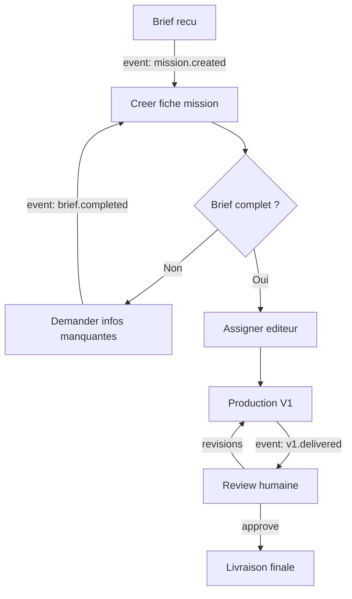

# PID Process — Bonnes Pratiques

## Definition

Un PID process = un PID standard qui implemente un processus operationnel complet. C'est un PID comme les autres — il utilise l'infra existante (aggregator, handler, lib, context store) pour faire tourner un processus metier.

Ce qui le distingue d'un PID classique, c'est qu'il est **pense autour de 3 phases conceptuelles** : onboarding, execution, auto-amelioration. Mais ces phases ne dictent PAS l'organisation du code. Un PID process peut contenir n'importe quoi : des scripts, des services, des APIs, des pipelines, des agents IA — c'est du code qui fait le travail, organise comme le developpeur le decide.

---

## Pourquoi un PID et rien d'autre

L'infrastructure existante couvre deja tout ce qu'un processus a besoin :

| Besoin du processus | Brique existante |
|---------------------|------------------|
| Capturer des events externes | Aggregator (connecteurs) |
| Reagir a des events | Handler (rules dans meta.yaml) |
| Executer des actions | Scripts, services, agents IA — tout ce qu'on veut |
| Demander une decision humaine | Interactive Cards (dashboard) |
| Planifier des actions recurrentes | Cron / Scheduler aggregator |
| Stocker de l'etat et des donnees | Context store (entites markdown) |
| Utiliser des services (email, scrape, etc.) | Lib (CLIs + profils) |
| Deleguer une tache complexe a une IA | agent-invoke |
| Lancer un sous-processus | Emettre un event ou agent-invoke vers un autre PID |

Pas besoin d'un "process engine", d'un format custom, ou d'un nouveau runtime. **Un processus, c'est un PID bien configure.**

---

## Structure

Il n'y a PAS de structure de dossiers imposee. Un PID process respecte le standard PID existant (.claude/CLAUDE.md, meta.yaml, .gitignore) et organise le reste selon ses besoins.

**Ce qui est obligatoire** (standard PID) :
- `.claude/CLAUDE.md` — role, regles, outils du process
- `meta.yaml` — identite (+ rules handler si le process reagit a des events)
- `.gitignore`

**Ce qui est recommande** :
- `.claude/README.md` — guide d'onboarding (si le process doit etre partageable)
- `resources/process.md` — documentation du process (etapes, roles, KPIs)

**Le reste est libre.** Le code peut etre organise en actions/, scripts/, services/, pipelines/, ou un seul fichier main.py — selon ce qui fait sens pour le process.

Exemple minimaliste :

```
pids/{profile}/mon-process/
+-- .claude/
|   +-- CLAUDE.md
+-- meta.yaml
+-- main.py
+-- .gitignore
```

Exemple plus structure :

```
pids/{profile}/mon-process/
+-- .claude/
|   +-- CLAUDE.md
|   +-- README.md
|   +-- resources/
|       +-- process.md
+-- meta.yaml
+-- actions/
|   +-- handle-event.sh
|   +-- handle_event.py
+-- scripts/
|   +-- daily-check.py
+-- .venv/
+-- .gitignore
```

Les deux sont valides. C'est le besoin qui dicte la structure, pas la convention.

---

## Les 3 phases conceptuelles

Ce ne sont pas des dossiers ou des composants techniques. Ce sont des **etapes de vie** du process. Chacune se materialise differemment selon le process.

### Phase 1 — Onboarding

L'onboarding prepare le process a tourner. **Il est optionnel** — si le process est personnel et ne sera pas partage, il n'y a pas besoin d'onboarding formel.

Si le process est destine a etre partage (installe chez un client, utilise par un autre PID, etc.), l'onboarding se materialise par :

- Un **README.md** qui explique comment mettre en place le process
- Un **setup.sh** qui installe les dependances
- Eventuellement un script de collecte d'informations initiales

**Regle cle** : si onboarding il y a, il doit etre **idempotent**. Le relancer ne casse rien.

**Interoperabilite** : si le context store contient deja des entites pertinentes (un ICP defini par un autre process, des contacts existants, etc.), l'onboarding les detecte et les reutilise au lieu de reposer les questions.

```python
# Exemple : detecter si l'ICP existe deja
from pathlib import Path
CONTEXT_STORE = Path("../../context/store")
icp_files = list(CONTEXT_STORE.glob("icp-*.md"))
if icp_files:
    print(f"ICP deja defini : {icp_files[0].stem}. Skip.")
```

---

### Phase 2 — Execution

C'est le process qui tourne. L'execution peut prendre n'importe quelle forme :

- Des **handler actions** (declenchees par des events via l'aggregator)
- Des **scripts cron** (planifies, recurrents)
- Des **services** ou **APIs**
- Des **agents IA** (via agent-invoke)
- Des **pipelines** (enchainement de scripts)
- Invocation **manuelle** (un humain ou un agent qui lance un script)
- N'importe quelle **combinaison** de tout ca

#### Event-driven (aggregator -> handler)

Si le process reagit a des events, il declare ses rules dans meta.yaml :

```yaml
# meta.yaml
name: process-gestion-projet
description: "Gestion de projet pour agence video"

proxy:
  rules:
    - match: { source: "configurator", type: "mission.created" }
      run: handle-new-mission
    - match: { source: "platform", type: "v1.delivered" }
      run: handle-delivery
    - match: { source: "interactive:process-gestion-projet", type: "review.*" }
      run: handle-review-response
  actions_dir: actions/
```

Les actions suivent les regles de [handler-action.md](handler-action.md) : .sh comme point d'entree, event en $1, input/output, pas de process bloquant.

#### Cron (actions recurrentes)

```yaml
# meta.yaml (section additionnelle)
crons:
  - id: daily-check
    schedule: "0 9 * * *"
    run: scripts/daily-check.py
  - id: weekly-report
    schedule: "0 18 * * 5"
    run: scripts/weekly-report.py
```

#### Manuel

```bash
agent-invoke ask process-gestion-projet "Cree une nouvelle mission pour le client X"
python3 scripts/create-mission.py --client "X" --brief "description"
```

#### Etapes humaines vs machine

A l'echelle la plus microscopique, chaque etape est soit **humaine** soit **machine**. Pas les deux en meme temps.

**Etape machine** = du code qui s'execute :

```python
def main():
    event = json.loads(sys.argv[1])
    mission = create_mission_record(event["payload"])
    notify_team(mission)
    assign_editor(mission)
```

**Etape humaine** = une interactive card qui attend une reponse. La reponse humaine re-rentre comme event dans l'aggregator -> le handler matche -> une action s'execute. La boucle continue.

```python
def main():
    event = json.loads(sys.argv[1])
    httpx.post(f"{BACKEND_URL}/api/conversations", json={
        "pid": "process-gestion-projet",
        "initiated_by": "proxy",
        "first_message": {
            "content": f"V1 livree pour mission {event['payload']['mission_id']}",
            "interactive": {
                "body": [
                    {"type": "text", "text": "**Review de la V1**", "weight": "bold"},
                    {"type": "input", "id": "feedback", "input_type": "textarea",
                     "label": "Commentaires"},
                ],
                "actions": [
                    {"id": "approve", "label": "Approuver", "style": "primary",
                     "action": {"type": "event",
                                "source": "interactive:process-gestion-projet",
                                "event_type": "review.approved"},
                     "inputs": "all", "resolves": True},
                    {"id": "revisions", "label": "Revisions", "style": "destructive",
                     "action": {"type": "event",
                                "source": "interactive:process-gestion-projet",
                                "event_type": "review.revisions-requested"},
                     "inputs": "all", "resolves": True},
                ]
            }
        }
    })
```

#### Sous-processus

Un process peut invoquer un autre process. Chaque sous-processus est un PID independant.

**Via event** (asynchrone) :

```python
httpx.post(f"{AGGREGATOR_URL}/events", json={
    "source": "process:gestion-projet",
    "type": "subprocess.delivery-tracking.start",
    "payload": {"mission_id": mission_id}
})
```

**Via agent-invoke** (synchrone) :

```python
result = subprocess.run(
    ["agent-invoke", "ask", "process-quality-control",
     f"Verifie la qualite du livrable {file_path}", "--json"],
    capture_output=True, text=True, timeout=300
)
```

Le process parent ne sait rien des internals du sous-processus. Il envoie un input et attend un output.

---

### Phase 3 — Auto-amelioration

L'auto-amelioration, c'est **une action comme une autre**. La seule difference : elle analyse de la data produite pendant l'execution au lieu d'agir sur le monde exterieur.

Concretement, c'est un script qui :
1. Recupere de la data (produite et/ou collectee pendant l'execution)
2. La compare aux KPIs ou aux objectifs definis
3. Agit en consequence : ticket, notification, event, ou passage a l'etape suivante

Ce script se declenche comme n'importe quelle action : par cron, par event (un seuil de KPI atteint), ou manuellement.

#### KPIs

Les KPIs sont definis dans `resources/process.md` (si le fichier existe) ou directement dans le code :

```markdown
## KPIs

| ID | Mesure | Cible | Alerte |
|----|--------|-------|--------|
| brief-to-delivery | Temps entre reception brief et livraison V1 | < 5 jours | > 7 jours |
| revision-rate | % de missions avec demande de revision | < 20% | > 40% |
```

#### Deux types de declencheurs

| Type | Ce qui se passe | Exemple |
|------|----------------|---------|
| **Alerte** (KPI critique) | Quelque chose ne va pas -> ticket ou notification | Delai de livraison depasse 7 jours |
| **Objectif atteint** (KPI positif) | On passe a l'etape suivante -> event ou action | Taux de conversion atteint 10% -> lancer la phase scale |

#### Exemple

```python
# Script d'analyse — declenche par cron ou event
import json, os, httpx

BACKEND_URL = os.environ.get("BACKEND_URL", "http://127.0.0.1:4810")
BACKEND_KEY = os.environ.get("BACKEND_INTERNAL_KEY", "proxy-internal-key")
AGGREGATOR_URL = os.environ.get("AGGREGATOR_URL", "https://events.multimodal-house.fr")

def analyze():
    # Recuperer la data (context store, DB, API, logs — peu importe la source)
    # Comparer aux KPIs
    # Si deviation -> creer un ticket
    deviations = check_all_kpis()

    if deviations:
        httpx.post(f"{BACKEND_URL}/api/conversations", headers={
            "X-Internal-Key": BACKEND_KEY
        }, json={
            "pid": "process-gestion-projet",
            "initiated_by": "proxy",
            "first_message": {
                "content": f"{len(deviations)} deviation(s) detectee(s)",
                "interactive": {
                    "body": [{"type": "text", "text": format_deviations(deviations)}],
                    "actions": [
                        {"id": "ack", "label": "Traiter", "style": "primary",
                         "action": {"type": "resolve"}},
                    ]
                }
            }
        })

if __name__ == "__main__":
    analyze()
```

#### Ce que l'auto-amelioration ne fait PAS (pour l'instant)

- Modifier le code du process automatiquement
- Modifier les seuils de KPI
- Ajouter/supprimer des etapes

Ces modifications passent par un ticket -> un humain valide -> un dev (humain ou IA) applique le changement. A terme, un agent IA pourra proposer des modifications, mais toujours avec validation humaine.

---

## Documentation du process (resources/process.md)

Recommande mais pas obligatoire. Si le process est complexe ou partage, un fichier `resources/process.md` decrit le process de maniere lisible par un humain ET par un LLM.

C'est une **vue** du process, pas la source de verite. La source de verite, c'est le code (scripts, meta.yaml, actions). Ce document aide a comprendre le process d'un coup d'oeil — mais si le code et la doc divergent, c'est le code qui a raison.

Le format est libre : markdown pur, Mermaid, ou un mix des deux. Les blocs Mermaid sont rendus en SVG interactifs par le dashboard AI Manager — c'est un bon moyen de visualiser le graphe du process.



Structure recommandee :

```markdown
# Process : {Nom}

## Objectif
Ce que ce process accomplit en 1-2 phrases.

## Roles
| Role | Qui | Responsabilite |
|------|-----|----------------|
| chef-de-projet | Humain | Valide les briefs, assigne, review |
| system | Machine | Notifications, rappels, calculs |

## Etapes

### 1. Reception du brief
- **Declencheur** : event mission.created
- **Executant** : machine
- **Actions** : extraire infos, creer fiche, notifier
- **Problemes possibles** :
  - Brief incomplet -> demander les infos manquantes

### 2. ...

## KPIs
(tableau)

## Sous-processus utilises
- process-X — fait Y

## Historique des modifications
| Date | Modification | Raison |
|------|-------------|--------|
```

---

## Integration avec le context store

Le PID process utilise le context store pour lire du contexte, ecrire de l'etat, et partager entre processes (un lead cree par un process est visible par les autres).

**Convention** : les entites creees par un process incluent le process dans leurs `refs` :

```yaml
---
id: mission-2026-05-07-acme
type: on-demand/spec
created: 2026-05-07
updated: 2026-05-07
status: active
refs: [client-acme, process-gestion-projet]
scope: global
---
```

---

## A ne PAS faire

| Interdit | Pourquoi | Alternative |
|----------|----------|-------------|
| Creer un "process engine" custom | L'infra existante suffit | Aggregator + handler + code libre |
| Inventer un format de definition custom (BPMN, process.yaml) | Complexite sans valeur | resources/process.md (markdown) + code |
| Imposer une structure de dossiers rigide | Chaque process a des besoins differents | Respecter le standard PID, organiser le reste librement |
| Laisser l'auto-amelioration modifier le code sans validation | Derive garantie | Ticket -> humain valide -> changement applique |
| Creer un process monolithique | Impossible a maintenir | Decouper en sous-processus (PIDs independants) |
| Dupliquer de la logique entre processes | Maintenance impossible | Extraire en service lib/ ou en outil partage |

---

## Checklist

Pas une checklist rigide — juste les questions a se poser :

### Le PID est-il un PID valide ?
- [ ] .claude/CLAUDE.md present
- [ ] meta.yaml present
- [ ] .gitignore couvre .env, .venv/, data runtime

### Onboarding (si partage)
- [ ] README.md explique comment mettre en place le process
- [ ] setup.sh installe les deps (si necessaire)
- [ ] Onboarding idempotent
- [ ] Detection du contexte existant (context store)

### Execution
- [ ] Le process fait ce qu'il est cense faire (ca parait evident, mais c'est le seul vrai critere)
- [ ] Les etapes humaines passent par des interactive cards (pas de blocage)
- [ ] Les sous-processus sont des PIDs independants

### Auto-amelioration (si pertinent)
- [ ] KPIs definis quelque part (process.md ou dans le code)
- [ ] Un mecanisme detecte les deviations (cron, event, ou autre)
- [ ] Les deviations produisent des tickets ou des notifications
- [ ] Pas de modification automatique du code sans validation humaine

***
